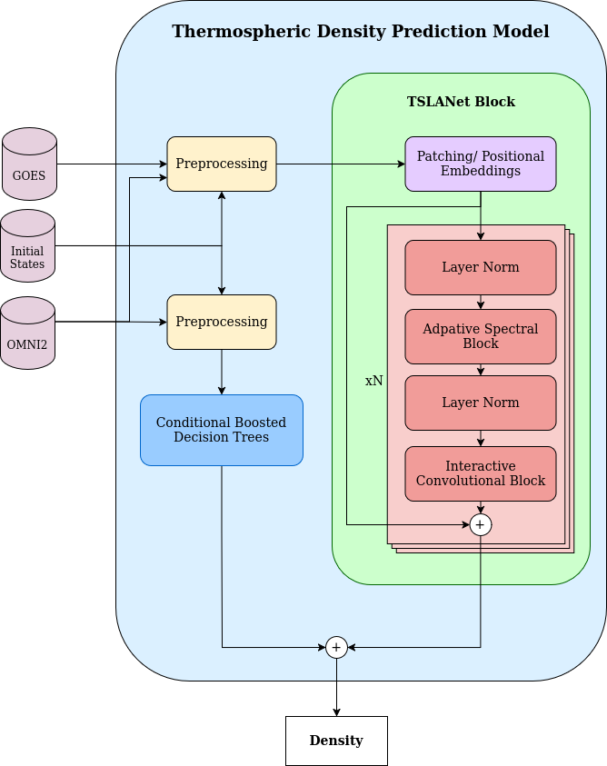

<div align="center">

# MIT-ARCLab25-STORMAI

## 🌍 Thermospheric Density Forecasting with Machine Learning

**Satellite Tracking and Orbit Resilience Modeling with AI Challenge**
<p align="center">
  <a href="https://www.codabench.org/competitions/5547/">Challenge</a> •
  <a href="https://2025-ai-challenge.readthedocs.io/en/latest/README.html">STORM-AI Dataset</a>
</p>

[]()
[]()

</div>

This repository contains the codebase developed for the MIT ARCLab STORM-AI Challenge 2025, focused on forecasting thermospheric orbit-averaged neutral mass density using AI/ML methods. Accurate density prediction is critical for satellite drag modeling, orbit propagation, and space situational awareness—especially during geomagnetically active periods.

The approach integrates physics-informed feature engineering with state-of-the-art machine learning techniques, including:

  * 🌡️ XGBoost-based Conditional Models for initial density estimation
  * 🔄 TSLANet (Time Series Lightweight Adaptive Network) for 72-hour density trend forecasting
  * ⚙️ Tools for data preprocessing, scaling, and feature extraction based on OMNI2 and ESA SWARM datasets
  * 📊 Benchmarking against truth data using custom evaluation metrics such as OD-RMSE

This repository is organized for transparency and reproducibility, and includes:

* Training scripts for decision tree and neural models
* Inference pipelines for both Phase 1 and Phase 1.2 datasets
* Environment setup (.yml) and dependencies
* Example visualizations and evaluation outputs

We hope this project helps advance data-driven techniques in thermospheric modeling and supports broader applications in space weather forecasting and satellite operations.
<div align="center">


<p align="center">
  
</p>
<div align="left">

### Directory Structure
```bash
├── data # documentation
│   └── STORM_AI_Report_Digantara-v1.pdf # phase-2 report 
├── data
│   └── links.txt # link to gdrive contianing training data
├── img
│   └── model-sketch.png
├── models
│   └── links.txt # link to gdrive contianing model weights
├── notebooks
│   ├── propagator_comparison.ipynb # notebook to compare orekit and sgp4
│   ├── sw-bdt-mit-v11.ipynb # notebook to train xgb_v11
│   └── tslanet.ipynb # notebook to train tslanet
├── README.md
├── requirements.yml
├── src
└── submissions
    ├── xgb_011
    │   ├── environment.yml
    │   ├── generate_model_class.py
    │   ├── gppropagator_vec.py
    │   ├── models # models are already linked; the folder has to be downloaded from gdrive
    │   │   ├── xgb-model-011-alt-0-f10-0.json -> ../../../models/xgb-model-011-alt-0-f10-0.json
    │   │   ├── xgb-model-011-alt-2-f10-0.json -> ../../../models/xgb-model-011-alt-2-f10-0.json
    │   │   ├── xgb-model-011-alt-2-f10-1.json -> ../../../models/xgb-model-011-alt-2-f10-1.json
    │   │   ├── xgb-model-011-alt-2-f10-2.json -> ../../../models/xgb-model-011-alt-2-f10-2.json
    │   │   ├── xgb-model-011-alt-3-f10-0.json -> ../../../models/xgb-model-011-alt-3-f10-0.json
    │   │   ├── xgb-model-011-alt-3-f10-1.json -> ../../../models/xgb-model-011-alt-3-f10-1.json
    │   │   ├── xgb-model-011-alt-3-f10-2.json -> ../../../models/xgb-model-011-alt-3-f10-2.json
    │   │   ├── xgb-model-011-alt-4-f10-0.json -> ../../../models/xgb-model-011-alt-4-f10-0.json
    │   │   ├── xgb-model-011-alt-4-f10-1.json -> ../../../models/xgb-model-011-alt-4-f10-1.json
    │   │   └── xgb-model-011-alt-4-f10-2.json -> ../../../models/xgb-model-011-alt-4-f10-2.json
    │   ├── submission.py
    │   └── swai
    │       ├── ConditionalXGBModel.py
    │       └── TSLANet.py
    └── xgb_012 # models are already linked; the folder has to be downloaded from gdrive
        ├── environment.yml
        ├── gen_xgboost.py
        ├── submission.py
        ├── swai
        │   └── XGboost.py
        └── XGBOOST
            ├── AP_0-32_Alt_201-400 -> ../../../models/AP_0-32_Alt_201-400
            ├── AP_0-32_Alt_401-600 -> ../../../models/AP_0-32_Alt_401-600
            ├── AP_156-301_Alt_201-400 -> ../../../models/AP_156-301_Alt_201-400
            ├── AP_156-301_Alt_401-600 -> ../../../models/AP_156-301_Alt_401-600
            ├── AP_33-65_Alt_201-400 -> ../../../models/AP_33-65_Alt_201-400
            ├── AP_33-65_Alt_401-600 -> ../../../models/AP_33-65_Alt_401-600
            ├── AP_66-94_Alt_201-400 -> ../../../models/AP_66-94_Alt_201-400
            ├── AP_66-94_Alt_401-600 -> ../../../models/AP_66-94_Alt_401-600
            ├── AP_95-155_Alt_201-400 -> ../../../models/AP_95-155_Alt_201-400
            └── AP_95-155_Alt_401-600 -> ../../../models/AP_95-155_Alt_401-600
```

### Installation

```python
conda create --name stormai -r requirements.yml
```